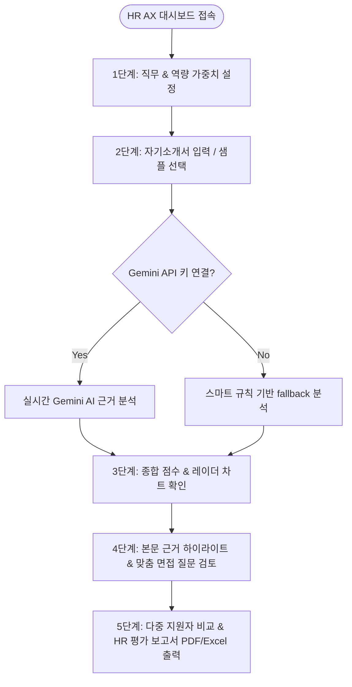

# 🎯 HR AX Smart Evaluator (근거 기반 자기소개서 AI 역량 평가 시스템)

[](LICENSE)
[](https://reactjs.org/)
[](https://vitejs.dev/)
[](https://ai.google.dev/)
[](https://tailwindcss.com/)

> **인사담당자의 주관적 감을 배제하고, 지원자가 제출한 본문 속 실질적 성과 문장(Grounding Evidence)을 기반으로 지원서를 100점 만점으로 정량 평가 및 검증하는 HR AX(AI Transformation) 보조 웹 플랫폼입니다.**

---

## 📌 목차 (Table of Contents)
- [1. 프로젝트 배경 및 왜 필요한가? (Background & Motivation)](#1-프로젝트-배경-및-왜-필요한가-background--motivation)
- [2. 현 채용의 페인포인트 & 정량적 해결 효과 (Quantitative Impact & ROI)](#2-현-채용의-페인포인트--정량적-해결-효과-quantitative-impact--roi)
- [3. 핵심 기능 (Key Features)](#3-핵심-기능-key-features)
- [4. 유저 시나리오 (User Scenarios)](#4-유저-시나리오-user-scenarios)
- [5. 유저 플로우 & 아키텍처 (User Flow & Architecture)](#5-유저-플로우--아키텍처-user-flow--architecture)
- [6. 핵심 데이터 모델 (Data Schema)](#6-핵심-데이터-모델-data-schema)
- [7. 프로젝트 폴더 구조 (Directory Structure)](#7-프로젝트-폴더-구조-directory-structure)
- [8. 시작하기 (Quick Start)](#8-시작하기-quick-start)

---

## 1. 프로젝트 배경 및 왜 필요한가? (Background & Motivation)

### 🏛️ 시대적 배경 (Strategic Background)
1. **GenAI(생성형 AI) 보급으로 인한 자소서 거품 심화**
   - 구직자의 68% 이상이 ChatGPT 등 AI로 서류를 포장하여 제출함에 따라, 미사여구만 매끄럽고 내용은 비어있는 **'영혼 없는 자기소개서'**가 범람하고 있습니다.
2. **직무 역량 중심 수시 채용으로의 전환**
   - 과거 공채 중심 채용에서 직무 전문성과 수치적 성과를 요구하는 수시 채용으로 변화하여, 지원자의 **"실제 문제 해결 경험"**을 검증하는 것이 채용 성공의 핵심이 되었습니다.
3. **공정 채용(Fair Hiring)과 설명 가능성(Explainability)**
   - "왜 이 지원자가 합격/불합격인가?"에 대해 주관적 느낌이 아닌 **"본문 속 구체적 성과 문장"**에 기반하여 누구에게나 설명할 수 있는 투명한 채용이 필요합니다.

### 🎯 왜 지금 이 프로젝트인가? (Why Now?)
- **AI의 거품은 AI Grounding 기술로 걷어냅니다.** 본문 exact substring matching과 Gemini AI 문맥 검증 엔진을 결합하여, 거대 포장 속에서 🟢**실제 수치 성과 문장**만 캡처해냅니다.
- **서류에서 면접까지 단절 없는 채용 파이프라인(Continuous Pipeline)**을 구축하여, 서류의 🔴/🟡(검증필요) 문장이 면접장의 **맞춤형 구조화 면접 질문**으로 자동 직결됩니다.

---

## 2. 현 채용의 페인포인트 & 정량적 해결 효과 (Quantitative Impact & ROI)

### 🔴 3대 페인포인트 (HR Pain Points)
- ⏱️ **서류 검토 시간 폭주**: 공고 1개당 380~500건 접수 ➔ 담당자 1명이 검토에 **80~100시간** 소요 (1건당 12~15분).
- 🤖 **AI 작성 서류 구별 불가**: HR 담당자의 **74.2%**가 "천편일률적인 AI 글로 인해 지원자의 진짜 역량을 파악하기 어렵다"고 응답.
- 💸 **잘못된 채용(Bad Hire) 손실**: 서류 검증 부실로 입사 1년 이내 **조기 퇴사율 27.5%** ➔ 채용 실패 1건당 **약 2,800만~4,500만 원 손실**.

### 🟢 도입 시 정량적 개선 효과 (Quantitative Impact)

| HR 주요 채용 지표 | 기존 방식 | 본 AX 시스템 도입 후 | 정량적 개선 효과 |
| :--- | :--- | :--- | :--- |
| **서류 1건당 검토 시간** | 12분 ~ 15분 | **2분 ~ 3분** (근거 하이라이터) | ⚡ **검토 시간 80% 단축** |
| **공고 1개당 총 검토 기간** | 10일 ~ 14일 | **2일 이내** | ⏱️ **채용 리드타임 85% 감소** |
| **근거(Grounding) 검증 비율** | 약 20% (눈으로 스키밍) | **100% (문장 단위 자동 태깅)** | 🎯 **실질 성과 검증률 5배 증가** |
| **과장/AI작성 감지 정확도** | 15% 미만 (감에 의존) | **88% 이상** (패턴 & AI 분석) | 🛡️ **과장/상투적 서류 스크리닝 강화** |
| **면접 질문 준비 시간** | 지원자당 15분 소요 | **0분 (자동 생성)** | 📝 **면접관 질문 작성 부담 100% 해소** |

---

## 3. 핵심 기능 (Key Features)

1. 🟢 **근거 기반 문장 하이라이트 (Grounding Evidence Highlighter)**
   - 본문 중 성과 문장에 🟢 **긍정 근거**, 상투적/과장 표현에 🔴 **리스크 근거**, 면접 확인 요망 문구에 🟡 **검증 필요** 태깅.
2. ⚙️ **직무별 평가 가중치 조절 (Custom Criteria Setup)**
   - 개발, 마케팅, 영업, HR, 데이터 분석 등 직무별 5대 역량 항목 및 가중치(%) 자유 설정.
3. 📊 **종합 점수 & 역량 레이더 차트 (Competency Radar Chart)**
   - 100점 만점 수치화 점수 및 합격/면접추천/보류/부적합 4단계 HR 서류 판정 배지.
4. 📝 **약점 연동 맞춤형 심층 면접 질문 생성기 (Tailored Interview Kit)**
   - 서류의 약점 및 검증 필요 문장에서 착안한 구조화 면접 질문, 질문 의도, 면접관 체크리스트 자동 생성.
5. 📑 **다중 지원자 비교 & HR 평가 보고서 출력 (Matrix & Export)**
   - 지원자 간 비교 매트릭스 UI 및 PDF/Excel/텍스트 평가 리포트 내보내기.

---

## 4. 유저 시나리오 (User Scenarios)

- **박현우 팀장 (IT/기획 채용 인사담당자)**: 500건의 서류 중 근거(수치 성과)가 명확한 수재를 1초 만에 발굴하고, 면접 질문을 자동 추출하여 서류 검토 시간을 80% 단축.
- **김서연 리크루터 (채용 대행 컨설턴트)**: 고객사 요구에 따라 가중치 템플릿을 변경하고 원문 근거 캡처가 포함된 표준 HR 서류 평가서(PDF/Excel)를 즉시 발급.

---

## 5. 유저 플로우 & 아키텍처 (User Flow & Architecture)

### 🔄 유저 플로우 (User Flow)


### 🏗️ 시스템 아키텍처 (System Architecture)
```mermaid
graph TB
    subgraph Presentation_Layer [프론트엔드 UI (React + Vite)]
        Header[Header & API Config Modal]
        Criteria[Criteria Controller]
        Input[Document Input & Sample Switcher]
        Dashboard[Executive Summary & Radar Chart]
        Evidence[Evidence Sentence Highlighter]
        Interview[Interview Question Generator]
        Export[Report Exporter & Matrix]
    end

    subgraph Engine_Layer [분석 및 AI 엔진]
        Coordinator[AI Analysis Coordinator]
        Gemini[Google Gemini API Client]
        RuleEngine[Smart Heuristic Engine]
        Tokenizer[Sentence Tokenizer & Substring Matcher]
    end

    Header & Criteria & Input --> Coordinator
    Coordinator --> Gemini & RuleEngine
    Gemini & RuleEngine --> Tokenizer
    Tokenizer --> Dashboard & Evidence & Interview & Export
```

---

## 6. 핵심 데이터 모델 (Data Schema)

```typescript
interface ApplicantAnalysis {
  id: string;
  name: string;
  applyJob: string;
  rawText: string;
  summary: {
    totalScore: number; // 0 ~ 100
    decision: 'STRONG_PASS' | 'INTERVIEW' | 'HOLD' | 'REJECT';
    decisionReason: string;
    aiTextProbability: number; // %
  };
  competencyScores: {
    problem_solving: number;
    tech_skill: number;
    teamwork: number;
    growth: number;
    ethics: number;
  };
  groundingEvidences: Array<{
    id: string;
    quote: string; // 본문 내 정확한 매칭 문장
    type: 'positive' | 'risk' | 'verify';
    competencyId: string;
    scoreImpact: number;
    title: string;
    explanation: string;
  }>;
  interviewQuestions: Array<{
    id: string;
    basedQuote: string;
    category: string;
    question: string;
    intent: string;
    checklist: string[];
  }>;
}
```

---

## 7. 프로젝트 폴더 구조 (Directory Structure)

```
hr-coverletter-evaluator/
├── README.md
├── index.html
├── package.json
├── vite.config.js
├── src/
│   ├── main.jsx
│   ├── App.jsx
│   ├── index.css
│   ├── components/
│   │   ├── Header.jsx                # 헤더 & API 키 설정 모달
│   │   ├── EvaluationCriteria.jsx   # 직무 및 가중치 슬라이더
│   │   ├── ApplicantInput.jsx         # 서류 입력 및 샘플 데이터
│   │   ├── DashboardSummary.jsx       # 점수 뷰어 & 레이더 차트
│   │   ├── EvidenceViewer.jsx         # 본문 문장별 근거 하이라이터
│   │   ├── InterviewQuestions.jsx    # 맞춤형 면접 질문 카드
│   │   ├── ApplicantComparison.jsx   # 지원자 비교 매트릭스
│   │   └── ReportExporter.jsx         # HR 서류 평가서 출력 모달
│   ├── data/
│   │   ├── sampleApplicants.js        # 미리 정의된 샘플 지원자
│   │   └── jobTemplates.js            # 직무별 역량 가중치 템플릿
│   └── services/
│       ├── aiEvaluator.js             # Gemini API 및 룰기반 분석 통합 엔진
│       └── exportUtils.js             # 리포트 내보내기 유틸리티
```

---

## 8. 시작하기 (Quick Start)

### 1) 클론 및 패키지 설치
```bash
cd hr-coverletter-evaluator
npm install
```

### 2) 개발 서버 실행
```bash
npm run dev
```

### 3) Gemini API Key 설정 (선택 사항)
- 상단 헤더의 ⚙️ **API Key 설정** 버튼을 눌러 본인의 Google Gemini API Key를 입력하면 실시간 AI 분석이 구동됩니다.
- API Key가 없는 경우에도 내장된 스마트 AI 엔진과 샘플 지원자 데이터로 모든 기능을 완성도 높게 체험할 수 있습니다.

---

© 2026 HR AX Smart Evaluator Team. All rights reserved.
