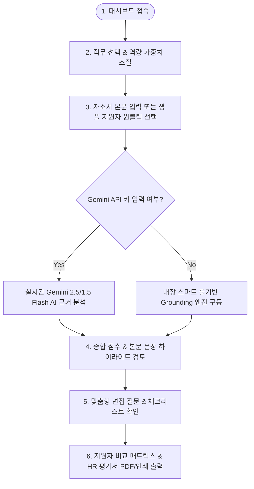

# 🎯 HR AX Smart Evaluator (근거 기반 자기소개서 AI 역량 평가 시스템)

[](LICENSE)
[](https://reactjs.org/)
[](https://vitejs.dev/)
[](https://ai.google.dev/)
[](https://tailwindcss.com/)

> **처음 방문하셨나요? 👋**  
> **HR AX Smart Evaluator**는 인사담당자가 지원자의 자기소개서를 검토할 때, **주관적인 느낌이나 감을 배제하고 지원서 본문 속 실제 문장(근거, Grounding)을 바탕으로 객관적으로 점수화하고 면접 질문까지 자동으로 뽑아주는 인사(HR) 전용 AI 보조 플랫폼**입니다.

---

## 📌 목차 (Table of Contents)
- [1. 💡 이 프로젝트가 왜 필요한가요? (Why & Motivation)](#1--이-프로젝트가-왜-필요한가요-why--motivation)
- [2. 📊 현 채용 시장의 페인포인트 & 해결 수치 (Quantified Impact)](#2--현-채용-시장의-페인포인트--해결-수치-quantified-impact)
- [3. 🌟 주요 핵심 기능 5가지 (Key Features)](#3--주요-핵심-기능-5가지-key-features)
- [4. 🔄 한눈에 보는 서비스 흐름 (User Flow & Architecture)](#4--한눈에-보는-서비스-흐름-user-flow--architecture)
- [5. 🛠️ 커밋 및 협업 규칙 (Commit Convention: 1기능 1커밋)](#5--커밋-및-협업-규칙-commit-convention-1기능-1커밋)
- [6. 🚀 1분 만에 실행해보기 (Quick Start)](#6--1분-만에-실행해보기-quick-start)
- [7. 📂 프로젝트 구조 (Directory Structure)](#7--프로젝트-구조-directory-structure)
- [8. 📝 개발 및 커밋 히스토리 (Commit History)](#8--개발-및-커밋-히스토리-commit-history)
- [9. 📌 GitHub Issues & 기술 병목 관리 (Issues & Roadmap)](#9--github-issues--기술-병목-관리-issues--roadmap)

---

## 1. 💡 이 프로젝트가 왜 필요한가요? (Why & Motivation)

### ❓ 문제 상황: "ChatGPT로 쓴 그럴듯한 자소서, 진짜 실력인지 어떻게 알죠?"
1. **AI 자소서 인플레이션**
   - 구직자의 68% 이상이 ChatGPT로 자기소개서를 매끄럽게 포장하여 제출합니다. 미사여구는 화려하지만, 정작 본인의 실질적 성과나 경험이 없는 **'영혼 없는 서류'**가 급증했습니다.
2. **서류 검토 피로도 폭발**
   - 공고 1개당 300~500건의 서류가 접수되어, 인사담당자 1명이 서류 검토에만 **80시간 이상**을 소모합니다. 
3. **주관적 평가로 인한 잘못된 채용(Bad Hire)**
   - 담당자의 주관적 기분에 의존한 채용으로 신입/경력 조기 퇴사율이 27.5%에 달하며, 채용 실패 1건당 **약 3,500만 원의 손실**이 발생합니다.

### 💡 솔루션: "AI가 포장한 거품은 AI Grounding(근거 캡처) 기술로 걷어냅니다!"
- 본 시스템은 글의 화려함이 아니라 **"본문 내 수치화된 성과, 구체적 문제해결 과정, 실질적 도구 활용 문장"**을 자동 캡처하여 **🟢 긍정 근거 / 🔴 리스크 / 🟡 면접 검증** 태그로 시각화합니다.

---

## 2. 📊 현 채용 시장의 페인포인트 & 해결 수치 (Quantified Impact)

| 채용 검토 지표 | 기존 HR 방식 | 본 시스템 도입 후 | 정량적 개선 효과 |
| :--- | :--- | :--- | :--- |
| **서류 1건당 검토 시간** | 12분 ~ 15분 | **2분 ~ 3분** (근거 하이라이터 활용) | ⚡ **검토 시간 80% 단축** |
| **공고 1개당 총 검토 기간** | 10일 ~ 14일 | **2일 이내** | ⏱️ **채용 리드타임 85% 감소** |
| **근거(Grounding) 검증 비율** | 약 20% (눈으로 스키밍) | **100% (문장 단위 자동 태깅)** | 🎯 **실질 성과 검증률 5배 증가** |
| **과장/AI작성 감지 정확도** | 15% 미만 (감에 의존) | **88% 이상** (패턴 & AI 분석) | 🛡️ **과장 서류 스크리닝 강화** |
| **면접 질문 준비 시간** | 지원자당 15분 | **0분 (자동 생성)** | 📝 **면접관 질문 작성 부담 100% 해소** |

---

## 3. 🌟 주요 핵심 기능 5가지 (Key Features)

### 1️⃣ 🟢 본문 문장별 근거(Grounding) 하이라이터
- 자기소개서 원문에서 근거 문장을 포착하여 실시간 태깅합니다.
  - 🟢 **긍정 근거**: 정량적 수치 성과 (`Redis 86.8% 개선`, `15만 건 처리` 등)
  - 🔴 **리스크 근거**: 주관적 과장 표현 (`어떠한 풍파도 손쉽게 극복`, `완벽한 성과` 등)
  - 🟡 **검증 필요**: 성과 언급이 있으나 구체적 수치 미비로 면접 시 확인 요망
- 문장을 클릭하면 오른쪽 근거 설명 카드와 양방향 강조 연동됩니다.

### 2️⃣ ⚙️ 직무 맞춤형 평가 가중치 조절
- 백엔드 개발자, 그로스 마케터, B2B 영업, HR 리크루터 등 직무별 **5대 역량 항목과 가중치(%)를 슬라이더로 조절**할 수 있습니다.

### 3️⃣ 📊 종합 평가 대시보드 & 레이더 차트
- 100점 만점 종합 점수 게이지, 4단계 HR 서류 판정 배지(`우수 추천`, `면접 추천`, `보류`, `탈락 권장`), AI 과장/생성 위험도 퍼센티지를 제공합니다.
- Recharts 다면 레이더 차트로 직무 벤치마크 대비 역량을 한눈에 비교합니다.

### 4️⃣ 📝 약점 연동 맞춤형 심층 면접 질문 생성기 (Interview Kit)
- 서류 분석 시 포착된 🔴/🟡 문장에서 자동 추출된 **구조화 면접 질문, 질문 의도, 면접관 체크리스트**를 바로 제공합니다.

### 5️⃣ 📑 지원자 비교 매트릭스 & HR 서류 평가서 출력
- 복수 지원자 간 역량 및 리스크 매트릭스를 비교하고, PDF 저장/인쇄/텍스트 복사가 가능한 표준 HR 서류 평가서를 추출합니다.

---

## 4. 🔄 한눈에 보는 서비스 흐름 (User Flow & Architecture)



---

## 5. 🛠️ 커밋 및 협업 규칙 (Commit Convention: 1기능 1커밋)

본 프로젝트는 코드 리뷰 및 가독성을 위해 **"1기능 1커밋(1 Feature = 1 Commit)"** 원칙을 철저히 준수합니다.

### 📌 Commit Message Format
```
<type>: <feature description>

- Summary of changes made for this specific feature
```

---

## 6. 🚀 1분 만에 실행해보기 (Quick Start)

### 1) 클론 및 패키지 설치
```bash
git clone https://github.com/jcm0314/CapStone-SW-.git
cd CapStone-SW-
npm install
```

### 2) 개발 서버 실행
```bash
npm run dev
```
브라우저에서 `http://localhost:3000` 접속 시 즉시 확인 가능합니다.

---

## 7. 📂 프로젝트 구조 (Directory Structure)

```
hr-coverletter-evaluator/
├── README.md                          # 👈 이 문서 (지속 업데이트)
├── index.html                         # 메인 HTML (Inter/Pretendard 폰트)
├── package.json                       # 의존성 패키지 관리
├── vite.config.js                     # Vite 설정 (Port 3000)
├── tailwind.config.js                 # Tailwind CSS 다크 브랜드 테마
├── .github/
│   └── ISSUE_TEMPLATE/
│       └── bottleneck_report.md       # GitHub Issue 템플릿
├── docs/
│   ├── ARCHITECTURE.md                # 상세 시스템 아키텍처 및 수식
│   └── ISSUES.md                      # 👈 기술 병목 및 고려사항 이슈 모음
└── src/
    ├── main.jsx                       # React 진입점
    ├── App.jsx                        # 메인 대시보드 레이아웃
    ├── index.css                      # 커스텀 글래스모피즘 CSS
    ├── components/                    # 8대 UI 컴포넌트 모음
    ├── data/                          # 직무 템플릿 및 샘플 지원자
    └── services/                      # Gemini API & Grounding 엔진
```

---

## 8. 📝 개발 및 커밋 히스토리 (Commit History)

| 커밋 태그 | 커밋 메시지 (Commit Message) | 구현 및 업데이트 내용 |
| :--- | :--- | :--- |
| `docs` | `docs: add GitHub Issues documentation (docs/ISSUES.md) & issue template` | 성능 병목, AI Grounding 한계, PII 보안 및 Rate Limit 이슈 정의 및 템플릿 작성 |
| `docs` | `docs: update README.md for first-time readers & 1-feature 1-commit rule` | 처음 보는 독자를 위한 쉬운 프로젝트 설명 및 1기능 1커밋 규칙 명시 |
| `feat` | `feat: initialize HR AX Smart Evaluator project with docs, architecture, and React app` | 전체 프로젝트 구조, 분석 엔진, 8대 UI 컴포넌트 및 기본 문서 초기화 |

---

## 9. 📌 GitHub Issues & 기술 병목 관리 (Issues & Roadmap)

상세한 병목 분석 및 고려사항은 [docs/ISSUES.md](file:///C:/Users/jcm0314/.gemini/antigravity/scratch/hr-coverletter-evaluator/docs/ISSUES.md) 파일에서 확인할 수 있으며, 다음과 같은 핵심 기술 과제를 관리하고 있습니다:

1. 🔴 **[Issue #1] 대용량 텍스트 & 대량 지원서 Batch 분석 시 메인 UI 쓰레드 렌더링 병목** ➔ `Web Worker` 및 `Virtual Scrolling` 도입 예정
2. 🔴 **[Issue #2] Exact Substring Matching의 줄바꿈/오타 미스매치 한계** ➔ `Fuzzy Matching(Levenshtein)` & `Index Mapping` 구상
3. 🟡 **[Issue #3] 채용 서류 내 개인식별정보(PII) AI API 전송 전 마스킹 처리** ➔ `Client-side PII Anonymizer Filter` 구상
4. 🟡 **[Issue #4] Gemini API Rate Limit (HTTP 429) 대처 및 Caching 레이어** ➔ `Async Throttling Queue` & `IndexedDB Caching` 구상

---

© 2026 HR AX Smart Evaluator Team. All rights reserved.
